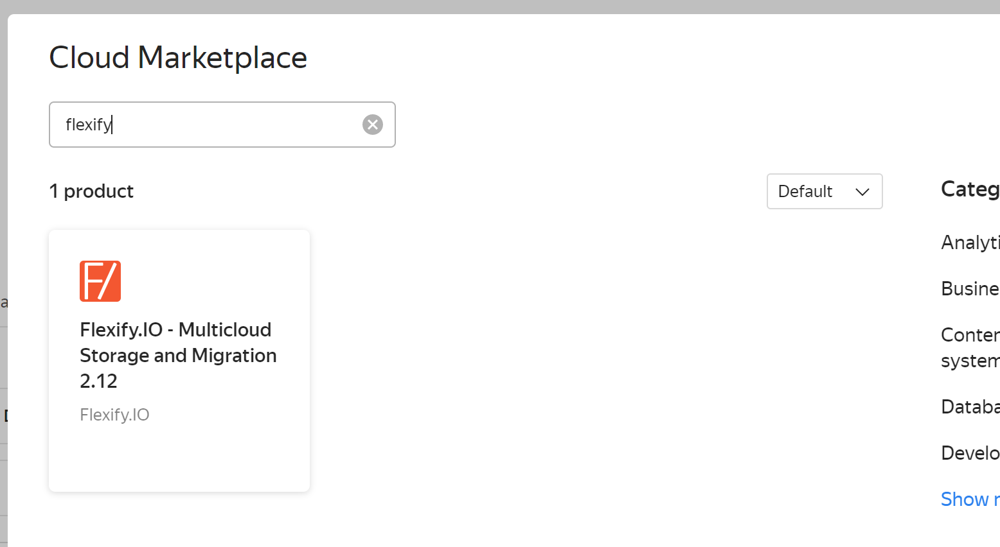
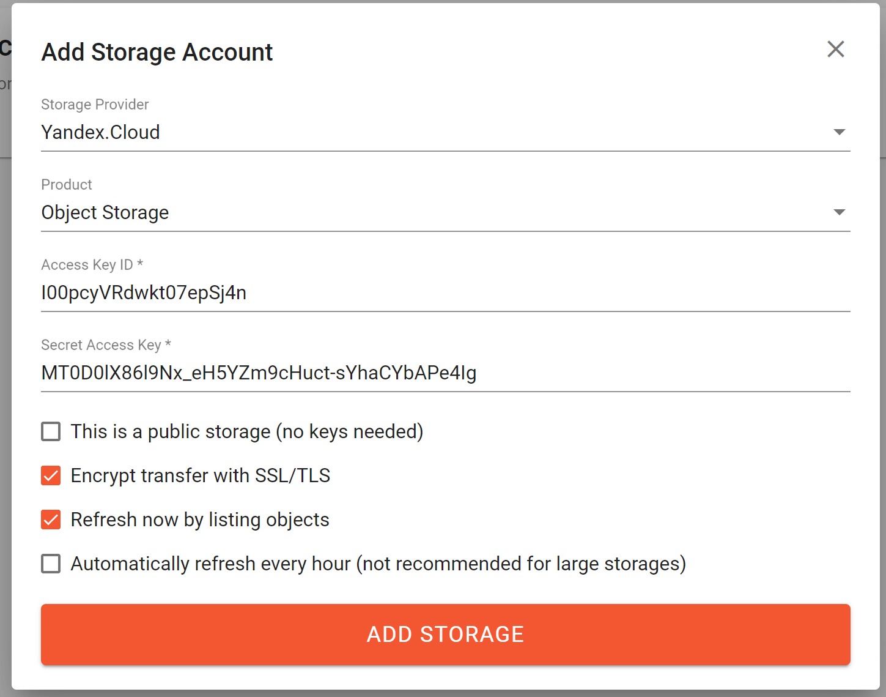
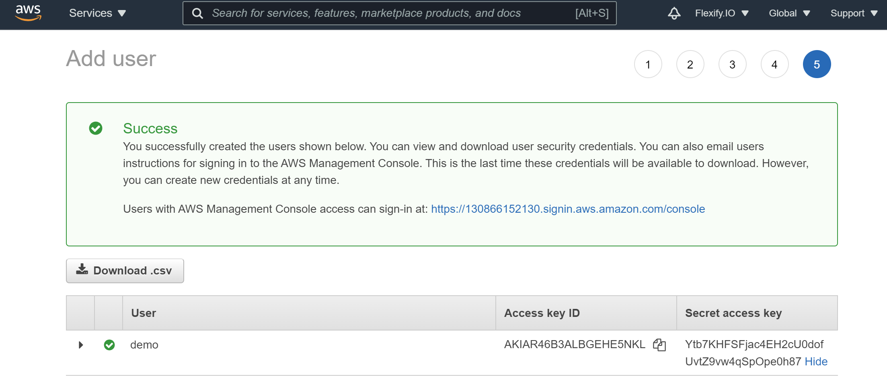
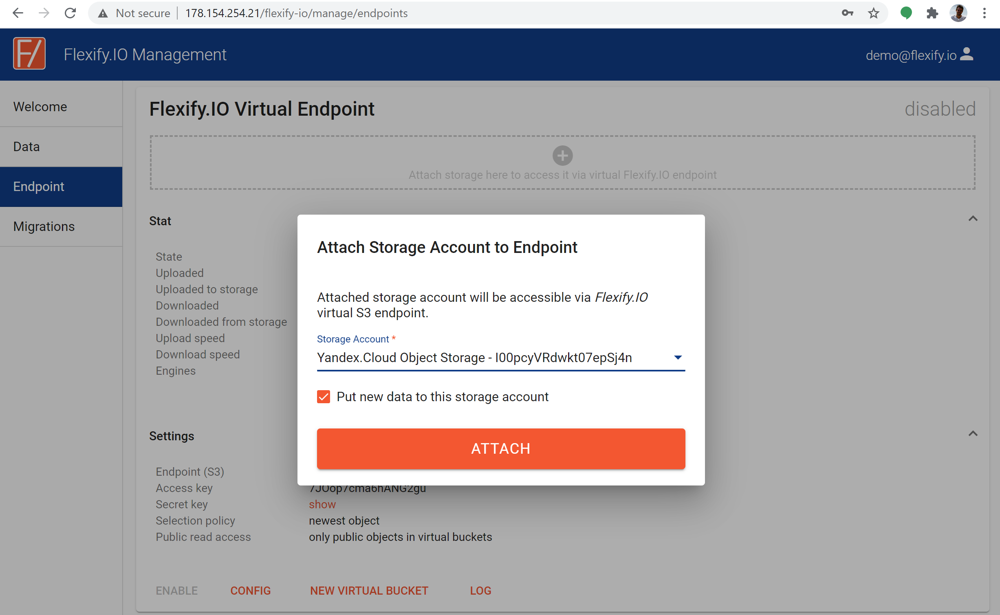
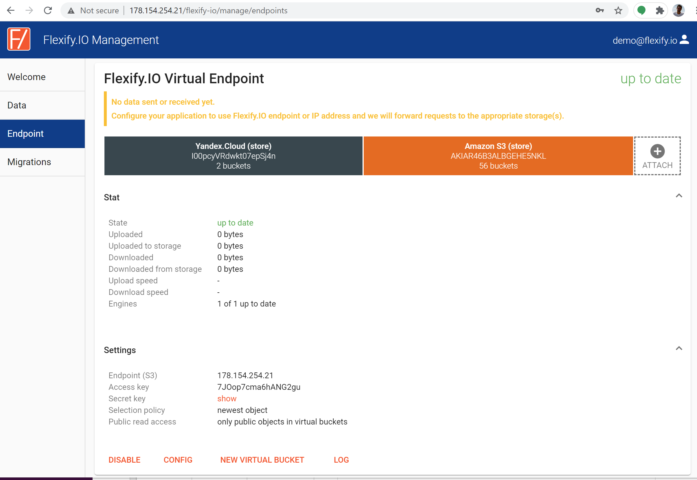
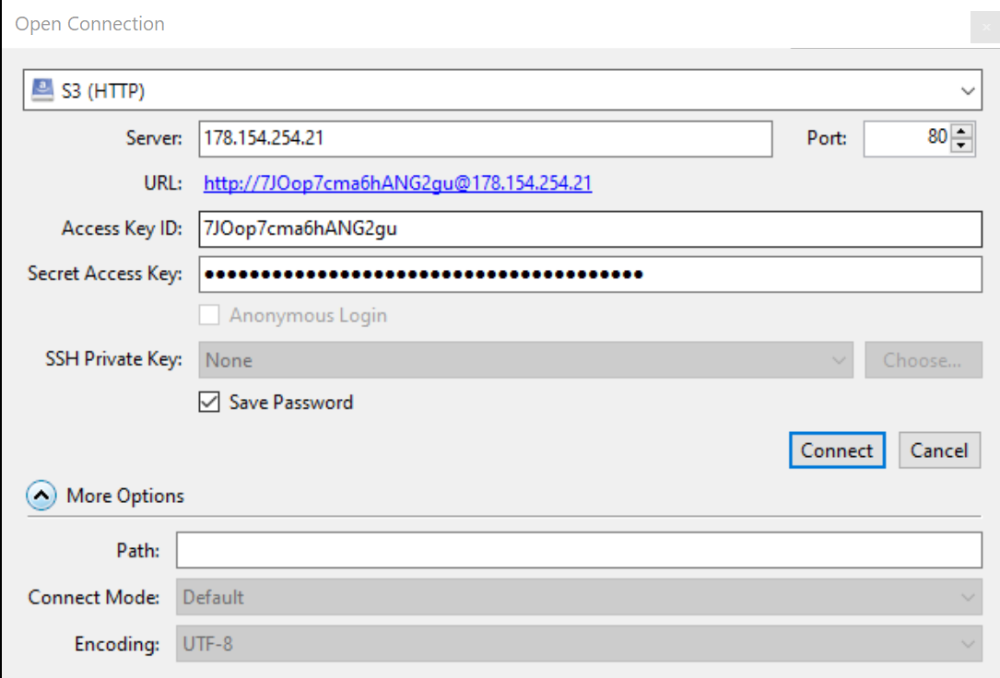
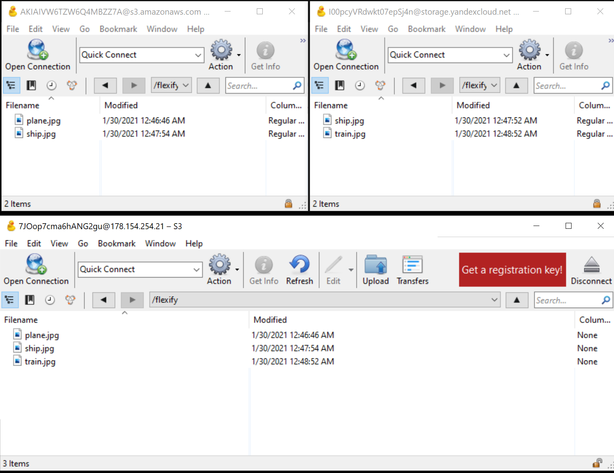
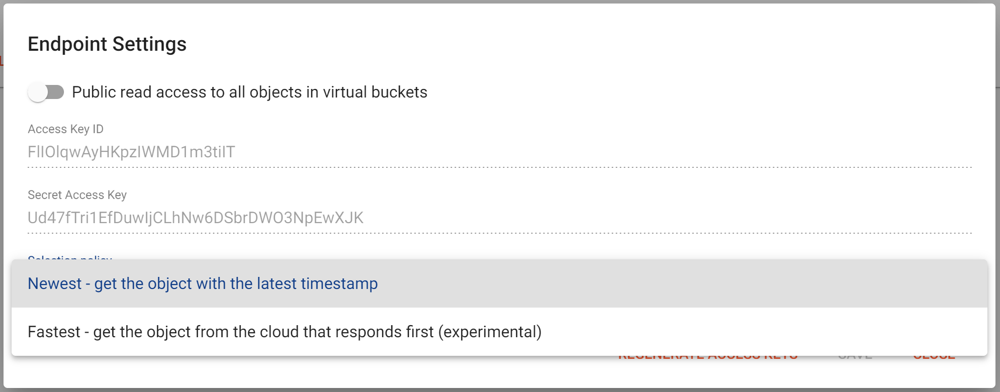

# Multi-cloud storage with Yandex.Cloud and Amazon S3

Flexify.IO allows transparently distributing data between [Yandex.Cloud Object Storage](https://cloud.yandex.com/services/storage) and [Amazon S3](https://aws.amazon.com/s3/). The following scenarios are supported:

- Storing a portion of the data in Yandex.Cloud, while the rest of the data is stored in Amazon S3.
- Cashing/offloading a portion of Amazon S3 data to Yandex.Cloud.
- Replicating data between Yandex.Cloud and Amazon S3.
- Migrating data between Amazon S3 and Yandex.Cloud.
In all scenarios, both Yandex.Cloud and Amazon Web Service virtual machines, as well as other services, have access to all the data, transparently and in a single namespace. 

## Deploying Flexify.IO

For Yandex.Cloud customers, we recommend deploying Flexify.IO from [Yandex.Cloud Marketplace](https://cloud.yandex.com/marketplace/products/f2e8u2ae4uv5ifiip7t3). 

- In the [Yandex.Cloud Console](https://console.cloud.yandex.com/) choose **Create VM** in the Compute Cloud section. 
- In the **Image/boot disk** selection select **Cloud Marketplace** and click **Show More**.
- Search for Flexify and select the latest version of Flexify.IO as the base image.

- Specify VM CPU and RAM depending on your projected usage (we recommend at least 2 CPU and 4 GB RAM), login, your public SSH key, and click **Create VM**.
- Once the VM is up and running, find VM's public IP address and open it in a browser.
### 
It may take a few minutes for the VM to start. Please, be patient and wait for the Create account dialog to apperar.
### 
If you choose to use HTTPS to connect to the VM, note that the initial SSL certificate will be self-signed and not automatically accepted by most browsers. 

- Create an account with any username or email address and password you will later use to sign in to this Flexify.IO installation.

## Adding storage accounts to Flexify.IO

Once signed in to the Flexify.IO Console, you can add one or more cloud storage accounts. 

To add a storage account, switch to the **Data** tab and click **Add Storage**. The Add Storage Account dialog will open. In this dialog, you can add a storage account from a supported cloud or on-premises object storage, including Yandex.Cloud, Amazon S3, Azure Blob Storage, Dell EMC ECS, and others. 

### Adding Yandex.Cloud

To add Yandex.Cloud Object Storage, you would first need to generate Yandex.Cloud access keys. 

- In the Yandex.Cloud Console select a cloud and choose **Service accounts** from the left menu.
- Create a new service account with the **storage.admin** role.

- Select the newly created account, click **Create new key**, and then **Create static access key**.

- Copy the key ID and the secret key to the clipboard. 

- In the Flexify.IO Console, choose Yandex.Cloud from the **Storage Provider** drop-down list and paste the access keys.

- Click **Add Storage**. This will add Yandex.Cloud storage account to Flexify.IO and start refreshing buckets to display statistics. 
### Adding Amazon S3

To add an Amazon S3 storage account to Flexify.IO, you would need to have Amazon S3 keys with permission to access Amazon S3 storage. 

- In the Amazon Web Services Console, choose IAM (available at [https://console.aws.amazon.com/iam/home](https://console.aws.amazon.com/iam/home)).
- On the **Users** tab click **Add user**.
- Specify the user name and choose to grant Programmatic access.

- Assign the **AmazonS3FullAccess** policy to the newly created account.

### 
While it is the easiest way, Flexify.IO does not need the full Amazon S3 access rights. For the example of IAM policy compatible with Flexify.IO, click Policy Example in the Add Storage Account dialog. 

- Once the user is created, copy-paste the Access key ID and the Secret access key.

- In the Flexify.IO console, choose Yandex.Cloud from the Storage Provider drop-down list and paste newly generated access keys. 

- Click **Add Storage** to add the storage account. 
## Migrating data from Amazon S3 to Yandex.Cloud

Once you have storage accounts added to Flexify.IO, you can copy or move data between them. 

- On the **Data** tab click **Transfer Data** (or click **New Migration** on the **Migrations** tab).
- In the **From** field select one or more buckets to migrate data from.
- In the **To** field choose Yandex.Cloud Object Storage. You can select any existing bucket, or let Flexify.IO create a new bucket. 

### About bucket names
You can type any name of the new bucket. However, make sure that the bucket name is globally unique. Even if someone else already has a bucket with the same name, you will be to be able to use it. 

- _Optionally_, click Advanced settings and fine-tune the migration setting. 
- Click Start Migration and monitor the migration progress.

## Combining data from Amazon S3 and Yandex.Cloud

The unique feature of Flexify.IO is the ability to combine data from two or more clouds into single virtual storage and make it accessible through a unified S3-compatible endpoint. 

To configure the Flexify.IO virtual endpoint:

- In the Flexify.IO console switch to the **Endpoint** tab.
- If no endpoint created yet, click **New Endpoint**.
- Click the (+) sign to attach Yandex.Cloud Object Storage to the virtual endpoint.

- Click (+) again to attach Amazon S3 storage to the virtual endpoint. 

Now all objects from Yandex.Cloud and Amazon S3 are combined and available via the S3-compatible endpoint on your Flexify.IO virtual machine. You would need to direct your application to use your machine's IP address (such as 178.154.254.21 in this example) with the access key and the secret key displayed in the endpoint settings. 

Flexify.IO will take S3 requests and forward them to all attached storages, combining the results. For example, if you have _plane.jpg _and _ship.jpg _in your Amazon S3 account, and _ship.jpg _and_ train.jpg_ in your Yandex.Cloud account, the combined view via the Flexify.IO Virtual Endpoint will have all three objects: _plane.jpg_, _ship.jpg_, and _train.jpg_.

### Read Policy

Imagine that in the example above Amazon S3 and Yandex.Cloud has different versions of _ship.jpg_. What version will the client get if requesting _ship.jpg _via the virtual endpoint? This is controlled by the read policy in the Endpoint settings. 

- By default, with the **Newest** policy, Flexify.IO will compare timestamps of objects in Amazon S3 and Yandex.Cloud and choose the latest version. This works best for the migration scenario where you write new data to Yandex.Cloud only, but need data yet in Amazon S3 to be readily available. 
- With the **Fastest** policy, Flexify.IO will deliver the version of the object from the cloud that responds first. This works best for the scenario when you have replicas of identical objects in both clouds and would like to optimize for the best performance.
### Write Policy

By default, Flexify.IO will replicate all data written via the virtual endpoint between all attached storages: both Yandex.Cloud and Amazon S3 in this case. 

You may want new data to be saved to Yandex.Cloud only, while having data still in Amazon S3 visible and accessible. To achieve this, you can disable writing data to Amazon S3 by clicking the Amazon S3 account on the storage bar and removing the** Put new data here **checkbox. 

Now new data will be saved to Yandex.Cloud Object storage only.

### Virtual Buckets

Bucket names need to be unique and you may not be able to create a bucket with the name you need in one or more clouds. Flexify.IO allows mapping bucket names with the help of virtual buckets. 

To create a new virtual bucket, just click **New Virtual Bucket** on the Endpoint card and specify the virtual bucket name. Then you can attach multiple buckets to the virtual bucket, and make all objects from the attached buckets available via the virtual bucket. 

### 
With virtual buckets, you can also combine data from multiple buckets of the same cloud provider. 
## Scaling out

The Flexify.IO virtual machine image from Yandex.Cloud Marketplace is a powerful solution for multi-cloud storage and migrating data between clouds. But it's limited to a single virtual machine. This limits options for horizontal scalability and fault tolerance. 

If you'd like to deploy Flexify.IO in the true cloud-native style with several horizontally-scalable, stateless, and centrally controlled Flexify.IO engines, please, contact us for installation instructions. 
